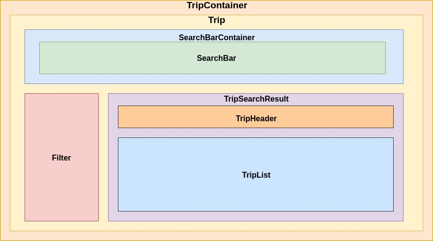

# Trip sorter Front

This project is the frontend of the trip sorter application.

## Installation
### Prerequisite
You have to install at least the v8.8.1 version of Node.js.
```
npm install
```

## Test

```
npm test
```

#### TroublesShooting
If you have an __ENOSPC__ error during test command :
```
  Error: watch /home/fooBar/dev/blah/lib/tools/testing/node_modules/core-js/modules ENOSPC
      at exports._errnoException (util.js:1022:11)
      at FSWatcher.start (fs.js:1429:19)
      at Object.fs.watch (fs.js:1456:11)
      at NodeWatcher.watchdir (/home/fooBar/.config/yarn/global/node_modules/sane/src/node_watcher.js:148:20)
      at Walker.<anonymous> (/home/fooBar/.config/yarn/global/node_modules/sane/src/node_watcher.js:361:12)
      at emitTwo (events.js:106:13)
      at Walker.emit (events.js:191:7)
      at /home/fooBar/.config/yarn/global/node_modules/walker/lib/walker.js:69:16
      at go$readdir$cb (/home/fooBar/.config/yarn/global/node_modules/graceful-fs/graceful-fs.js:149:14)
      at FSReqWrap.oncomplete (fs.js:123:15) 
```

Execute the following command to avoid ENOSPC and increase the amount of inotify watchers: 
`echo fs.inotify.max_user_watches=524288 | sudo tee -a /etc/sysctl.conf && sudo sysctl -p
`

## Start
### Prerequisite
Ensure that the trip-sorter-api project is run before.

Run the following command to start the project on local environment. The application is available on [http://localhost:3000/trip](http://localhost:3000/trip) URL.

```
npm start
```

## Directory Structure

Here is the organisation of the project:

Directory            | Description
-------------------- |-------------
`./src/common/`      | Common code here. (eg theme)
`./src/components/`  | React Components
`./src/services/`    | Services implemented by Redux 


## Architecture
Below, the component diagram architecture


## Design and implementation decisions

The application is build with React Javascript Framework. The `react-router-dom` is used to handle the _routes_ navigation (even though there is only one here for the moment). Data application is shared with `redux` to retrieve cities and trips from backend API.

All data collection is managed by __lodash__ library and all data time is managed by __moment__ library.
The __debounce__ library is used in search bar component to launch request to the server only when stopping enter text and to prevent to send request on each character typed.
The __currency-symbol-map__ library is used to convert a currency by its symbol.
About design, the __material-ui__ components are used and a global theme is define in __common__ directory.
Styles CSS are managed by __cxs__ library to maximize performance and deduplication.
